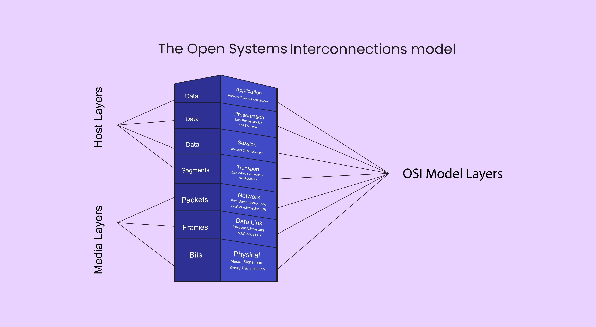

# yBank v2 🏦

**yBank v2** es una plataforma de gestión financiera personal diseñada bajo la filosofía "Zero Config". Su objetivo principal es automatizar la ingesta de datos financieros a través del procesamiento de correos electrónicos bancarios utilizando Inteligencia Artificial, eliminando la entrada manual de datos.

## 1. Stack Tecnológico y Dependencias 🚀

Elegimos tecnologías modernas que priorizan el rendimiento, la seguridad de tipos y la experiencia de desarrollo.

#### Core

* **Next.js 15 (App Router):** Framework principal. Usamos el App Router para aprovechar los Server Components y Server Actions, eliminando la necesidad de una API REST separada para funciones internas.
* **TypeScript:** Lenguaje base. Todo el código es estrictamente tipado para evitar errores financieros (ej: sumar textos con números).
* **Supabase:** Backend-as-a-Service. Provee la base de datos PostgreSQL, Autenticación y Almacenamiento.
* **Tailwind CSS** Framework de utilidades para estilos. Permite un desarrollo de UI rápido y consistente.

#### Librerias Clave

```
Librería	| Propósito	Patrón Relacionado
@supabase/ssr	Manejo de autenticación y cookies en el servidor (Next.js).	Singleton (Cliente DB)
googleapis	Cliente oficial para conectar con Gmail API.	Adapter (Ingesta)
openai (Futuro)	SDK para conectar con modelos GPT/Gemini.	Service (Parsing)
clsx + tailwind-merge	Utilidad cn() para gestión condicional de clases CSS.	Utility
lucide-react	Iconografía ligera y optimizada.	Component
Sonner  Biblioteca popular de Notificaciones
Lootie-react    Biblioteca para diseños animados tipo json
date-fns	Manipulación de fechas (Timezones, formatos).	Utility
```

## 📂 Arquitectura del Proyecto

EEl proyecto sigue una Arquitectura en Capas (Layered Architecture) adaptada a Next.js. Separamos estrictamente la Presentación (UI) de la Lógica de Negocio.



#### Estructura de Directorios (src/)
```
src/
├── app/                  # [CAPA DE PRESENTACIÓN]
│   ├── (auth)/           # Rutas públicas (Login)
│   ├── (dashboard)/      # Rutas protegidas (requieren sesión)
│   └── actions.ts        # Server Actions (Punto de entrada al backend desde UI)
│
├── components/           # [UI BUILDING BLOCKS]
│   ├── ui/               # Componentes base (Botones, Inputs) - Reutilizables
│   └── domain/           # Componentes de negocio (TransactionCard, AccountList)
│
├── services/             # [CAPA DE LÓGICA DE NEGOCIO] - EL CEREBRO 🧠
│   ├── banking/          # Reglas para crear cuentas, detectar bancos duplicados
│   ├── transactions/     # Lógica de inserción y categorización
│   ├── mail/             # Lógica de conexión con proveedores de correo
│   └── ai/               # Prompts y lógica de parsing de texto
│
├── lib/                  # [CAPA DE INFRAESTRUCTURA]
│   ├── supabase/         # Configuración de clientes (Server vs Browser)
│   └── utils.ts          # Helpers puros
│
└── types/                # [DEFINICIONES DE DOMINIO]
    └── database.ts       # Tipos generados automáticamente desde SQL
```
## 3. Patrones de Diseño Implementados

#### A. Adapter Pattern (Patrón Adaptador)

**Problema**: Hoy Usamos Gmail, mañana Outlook o WebHooks de SendGrid.
**Solucion:** Definimos una interfaz comun IMailProvider. El resto de la app no sabe si los correos vienen de Google o Microsoft, solo recibe "Emails Normalizados"

* Ubicacion `SRC/Services/Mail/Adapters/`

#### B. Service Layer Pattern ( Patron Servicio )

**Problema:** Escribir consultas SQL (`Supabase.from...`) dentro de los componentes de React hace que el codigo sea dificil de probary reutilizar.
*Solucion:* : Los componentes de React NUNCA llaman a la base de datos directamente para escribir datos. Llaman a una función en `src/services/`.

* Ejemplo: `BankingService.getOrCreateBank(name)` contiene la lógica de "Upsert", no el botón del frontend.

#### C. Server Actions como Controladores

**Problema:** Crear endpoints API REST (/api/bancos) para cada pequeña acción es tedioso. 
**Solución:** Usamos Server Actions. Son funciones asíncronas que actúan como "Controladores", recibiendo datos del formulario, validando permisos y llamando a la Capa de Servicios.

--------------------
## 4. Buenas Prácticas y Reglas de Desarrollo

#### Reglas de Componentes (Client vs Server)
1. **Por defecto, todo es Server Component:** Intenta no usar 'use client' a menos que necesites useState, useEffect o interactividad (onClick).

2. **Fetch de Datos:** Hazlo directamente en el Server Component (page.tsx) y pasa los datos como props a los componentes cliente.

#### Seguridad

1. **RLS (Row Level Security):** Nunca confíes en el frontend. Toda tabla en Supabase debe tener políticas RLS activas (auth.uid() = user_id).

2. **Validación de Tipos:** No usar any. Si la respuesta de la API es incierta, define una interfaz o usa Zod para validarla.

#### Estilos

1. Usamos la funcion cn() para mezclar clases.

* ✅ className={cn("bg-red-500", className)}

* ❌ className={"bg-red-500 " + className}

## 🛠️ Configuración Local

1.  **Variables de Entorno:** Duplica .env.example a .env.local y configura:
    ```bash
    NEXT_PUBLIC_SUPABASE_URL=...
    NEXT_PUBLIC_SUPABASE_ANON_KEY=...
    GOOGLE_CLIENT_ID=...
    GOOGLE_CLIENT_SECRET=...
    ```

2.  **Instalar Dependencias:**
    ```
    npm install
    ```

3.  **Correr servidor de desarrollo:**
    ```bash
    npm run dev
    ```

## 📝 Roadmap

- [x] Inicialización del proyecto y estructura de carpetas.
- [ ] Configuración de Cliente Supabase (Server & Client).
- [ ] Implementación de Autenticación con Google.
- [ ] Creación de Servicio de Adaptador de Gmail.
- [ ] Lógica de "Auto-Discovery" de bancos.